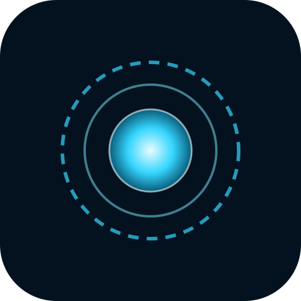

# J.A.R.V.I.S. 🛡️

Dein persönlicher KI-Assistent im Iron-Man-Stil – mit futuristischem Interface,
**Sprachsteuerung** und Anbindung an die Claude-KI. Läuft im Browser und lässt
sich auf dem **Handy als App installieren** (PWA).



## Was Jarvis kann

- 🎙️ **Sprachein- und -ausgabe** – rede mit ihm, er antwortet mit Stimme
- 💬 **Aufgaben per Text oder Sprache** – Fragen, Planung, Ideen, Code, Erklärungen …
- 🤖 **Echte KI** über die Claude-API (streamt die Antwort live)
- 📱 **Mobil nutzbar** – als App auf dem Homescreen installierbar
- 🌐 **Arc-Reaktor-Interface** mit Live-Visualisierung

## Schnellstart

### 1. Voraussetzungen
- [Node.js](https://nodejs.org) Version 18 oder neuer
- Ein Anthropic-API-Schlüssel von <https://console.anthropic.com>

### 2. Einrichten
```bash
npm install
cp .env.example .env
# .env öffnen und deinen ANTHROPIC_API_KEY eintragen
```

### 3. Starten
```bash
npm start
```
Dann im Browser öffnen: <http://localhost:3000>

## Auf dem Handy benutzen

Damit dein Handy den Server auf dem Computer erreicht, müssen beide im **selben
WLAN** sein.

1. Finde die lokale IP deines Computers (z. B. `192.168.0.42`).
2. Öffne auf dem Handy: `http://192.168.0.42:3000`
3. **Als App installieren:**
   - **iPhone (Safari):** Teilen-Symbol → „Zum Home-Bildschirm"
   - **Android (Chrome):** Menü ⋮ → „App installieren"

> 💡 **Hinweis zur Sprachsteuerung:** Mikrofon und Spracherkennung funktionieren
> aus Sicherheitsgründen nur über `https` oder `localhost`. Für die volle
> Sprachfunktion unterwegs die App bei einem Hoster mit HTTPS bereitstellen
> (z. B. Render, Railway, Fly.io) oder lokal einen HTTPS-Tunnel wie
> [`ngrok`](https://ngrok.com) nutzen: `ngrok http 3000`.

## Konfiguration (.env)

| Variable            | Bedeutung                              | Standard          |
|---------------------|----------------------------------------|-------------------|
| `ANTHROPIC_API_KEY` | Dein Claude-API-Schlüssel (Pflicht)    | –                 |
| `JARVIS_MODEL`      | Welches Claude-Modell genutzt wird     | `claude-opus-4-8` |
| `PORT`              | Port des Servers                       | `3000`            |

## Technik

- **Backend:** Node.js + Express, streamt Antworten von der Claude-API per SSE.
- **Frontend:** reines HTML/CSS/JS (keine Frameworks), Web Speech API für
  Sprache, Canvas für die Reaktor-Visualisierung, PWA für die Handy-Installation.
- Kein API-Schlüssel im Browser – alle KI-Aufrufe laufen über den Server.
